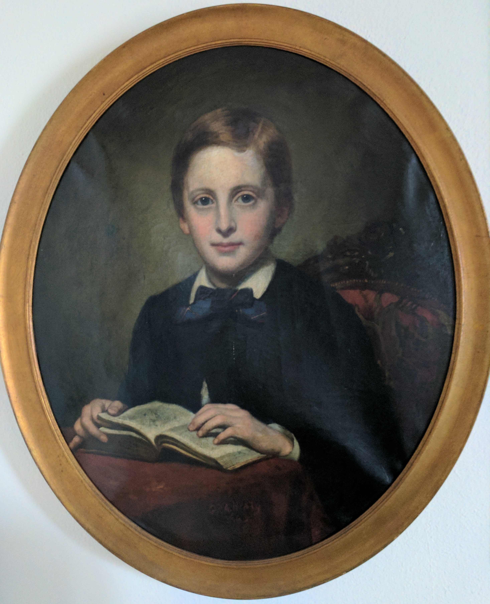
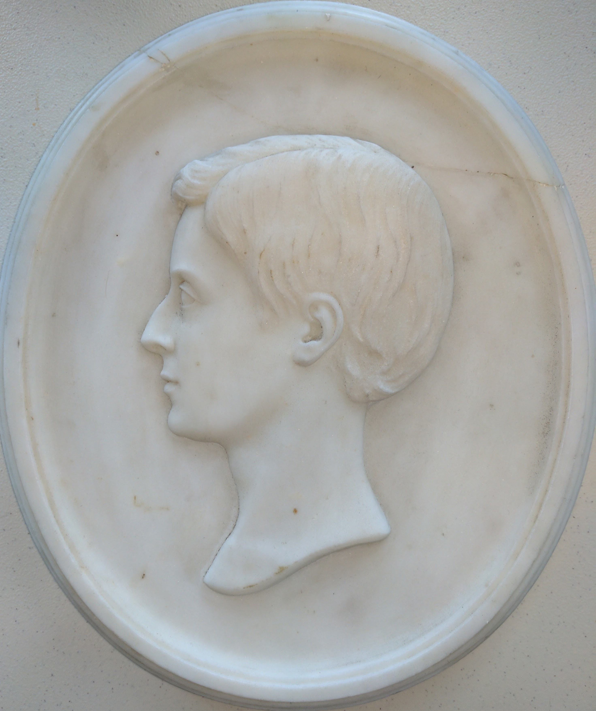

# Barbara Allison Armour ( 1826-1898)

* https://www.wikitree.com/wiki/Allison-5189
* https://www.findagrave.com/memorial/112151576/barbara-armour
* Born East Kilbrich, Scotland
* Wife of [George Armour]( https://en.wikipedia.org/wiki/George_Armour )
	* Built first grain elevators inChicago
	* President Chicago Board of Trade
	* First president Chicago Art Institute
	* https://www.wikitree.com/wiki/Armour-829

***

## Sir Lawrence Alma-Tadema ( 1836-1912 )

* https://en.wikipedia.org/wiki/Lawrence_Alma-Tadema
* https://www.britannica.com/biography/Lawrence-Alma-Tadema
* https://www.alma-tadema.org/
* http://www.lawrencealmatadema.org/paintings/

* https://commons.wikimedia.org/wiki/File:1865-barbara-allison-armour-painted-by-sir-lawrence-alma-tadema.jpg

Portrait of Barbara Allison Armour ~ 1865

* Dimensions: 24 x 17-3/4
* Signed by the artist
* Lavish wood frame with gold paint with initials "AT"
	* Verbal offer of $70,000 for frame from Madison Avenue frame dealer in 1997
* Receipt from artist fo 500 pounds sterling

## 1894 Anders Zorn

### Mrs. Armour

* Dimensions: 10 x 15
* https://www.artic.edu/artworks/55266/mrs-armour
* http://www.zorninamerica.com/ZornandStGaudens.html
* http://www.zorninamerica.com/Subpages/zia/Subjects/ZiaSubjects3.html
* https://www.alamy.com/stock-photo-1894-barbara-allison-armour-etching-by-anders-zorn-142555685.html

## 1870~ Unknown photographer

### Barbara Allison Armour

Dimensions: 8 x 10
Location: bedroom

***

Works portraying her son

## George Peter Alexander Healy

* https://en.wikipedia.org/wiki/George_Peter_Alexander_Healy

John William Armour

* Dimensions: 23 x 28
* Signed "G P A Healy"

## Unknown sculptor ~ 1864~

bas relief

From newspaper clipping attached to back

> This morning, John William Armour, son of George Armour, esq, in the 14th year of his age, this dear boy was long and invalid, often suffering acute pain; But he bore it all with patience and resignation. He had a beautiful face, sweet disposition and was singularly intelligent and refined. His conscious was alive to the demands of duty and we believe that in his heart was the right in the sight of God. Several since his father took him to Europe with the hope that change of climate would restore his health, but the hope was disappointed and he has just returned home to die. The time and place of the funeral will be duly announced in the papers.

In pencil under the clipping: "Died May 16, 1865"

***

Works in Armour collection

See: [Armour Fine Art Manifest]( #../armour-fine-art/2020-armour-fine-art-manifest.md )

## 1859 James McNeill Whistler

### Billingsgate

* https://www.metmuseum.org/art/collection/search/372512
* https://www.christies.com/lotfinder/Lot/james-abbott-mcneill-whistler-1834-1903-billingsgate-6020317-details.aspx

Dimensions: 15 x 10
Location: hall

## 1860s-g-guibas-piazzetta.jpg

Dimensions: 21-1/2" x 43-1/2"
Location: living room

